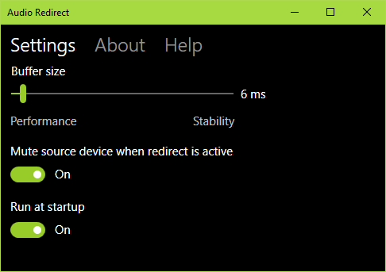

# Audio Redirect

Audio Redirect works around problems in games such as Final Fantasy XIV where
changing the system playback device causes audio to drop out until you restart
the game. It mutes the default device, captures all audio sent to it, and
redirects it to a different device instead, allowing you to change the playback
device without breaking the game's audio.

## How It Works
First, install [.NET Framework 4.6.2](https://www.microsoft.com/en-us/download/details.aspx?id=53344).
(If you are running Windows 10 Anniversary Update or newer, you already have this.)

Next, download [the latest release](https://github.com/ChaosinaCan/AudioPipe/releases/latest)
and unzip it somewhere. Run **AudioRedirect.exe** to start the program. A speaker
icon will appear in the notification area.

Click it to open a list of playback devices.

Click any device to start redirecting audio to it.

The speaker icon will change to headphones. Audio Redirect will mute your
default playback device and begin redirecting to the selected device. To stop
redirecting audio, open the list again and select **Use default device**.

You can also right click the icon and select **Settings** to adjust some settings.
If you get audio dropouts, try increasing the latency, or if your computer can
handle it, you can decrease the latency from its default of 10 ms. You can also
configure Audio Redirect to not mute the default playback device if you want
audio to play from both devices.

## Credits
Audio Redirect uses WASAPI capture via [CSCore](https://github.com/filoe/cscore).
The UI code is based on [EarTrumpet](https://github.com/File-New-Project/EarTrumpet).
[The icon](https://thenounproject.com/term/audio-to-audio/914488/) is by Oliviu Stoian.
